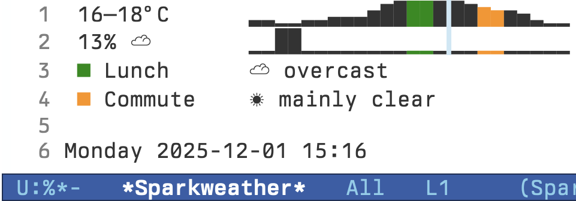

# `sparkweather`

 [](https://melpa.org/#/sparkweather)

Weather forecasts with sparklines for Emacs, using data from [Open-Meteo]( https://open-meteo.com).



## Installation

Sparkweather is available in [MELPA](https://melpa.org/#/getting-started).

### [Elpaca](https://github.com/progfolio/elpaca)

```elisp
(use-package sparkweather
  :ensure (:host github :repo "aglet/sparkweather")
  :after calendar)
```

## Configuration

Sparkweather uses the standard Emacs calendar location variables. If you haven't set these already:

```elisp
(setq calendar-latitude -41.3   ; Wellington, New Zealand
      calendar-longitude 174.8)
```

For other configuration, `M-x customize-group` / `sparkweather`.

## Usage

`M-x sparkweather` displays today's forecast with a temperature sparkline, and one for precipitation if applicable. A small space in the sparklines indicates the time of the forecast, and coloured blocks mark lunch/evening commute windows, with summaries.

Press `g` to refresh, `q` to close.

## License

[MIT](LICENSE)
